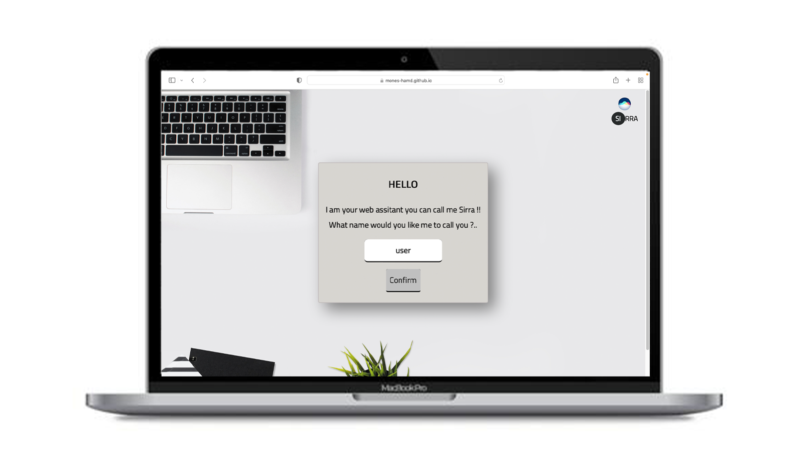
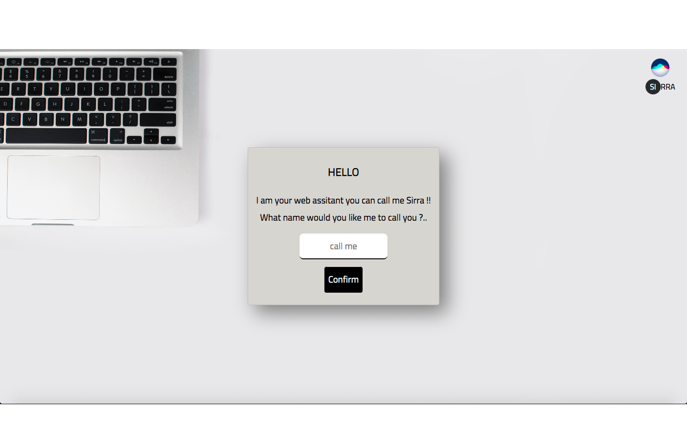
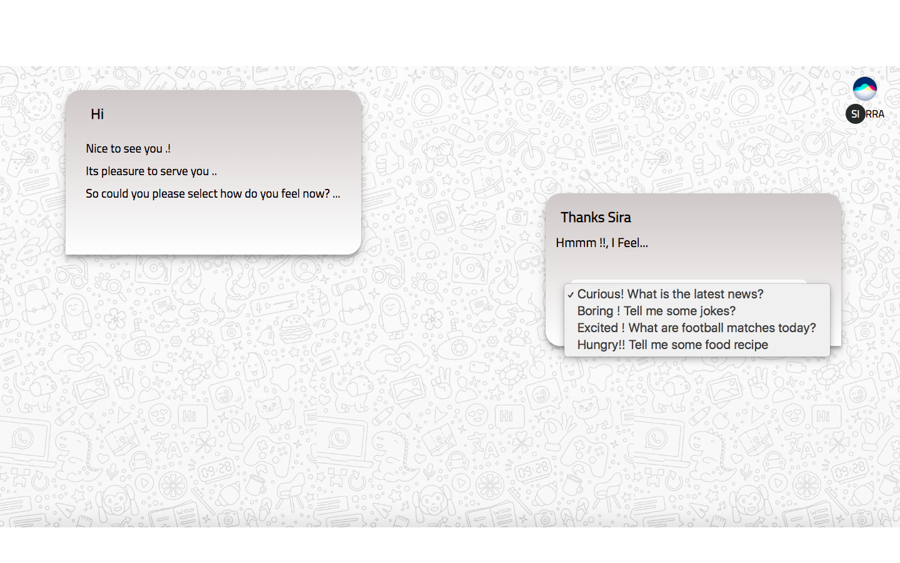
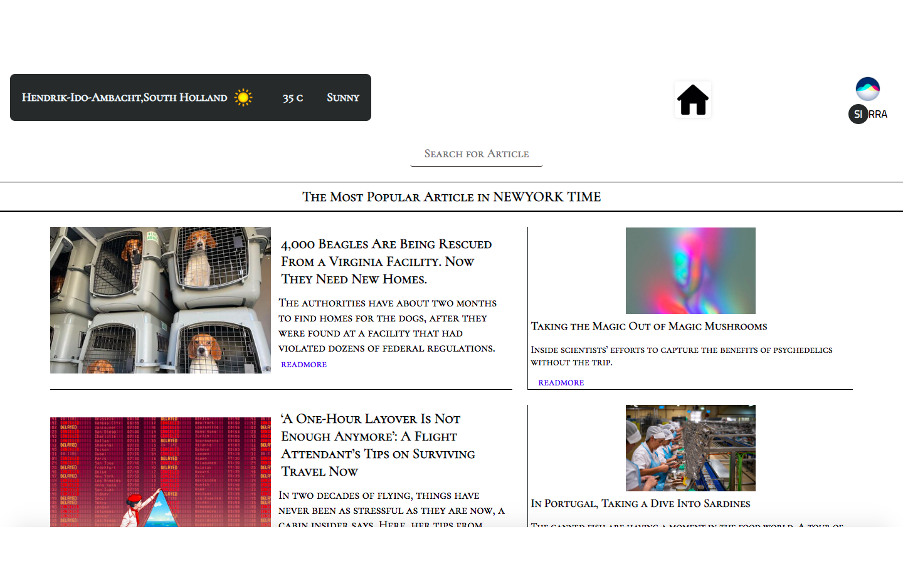
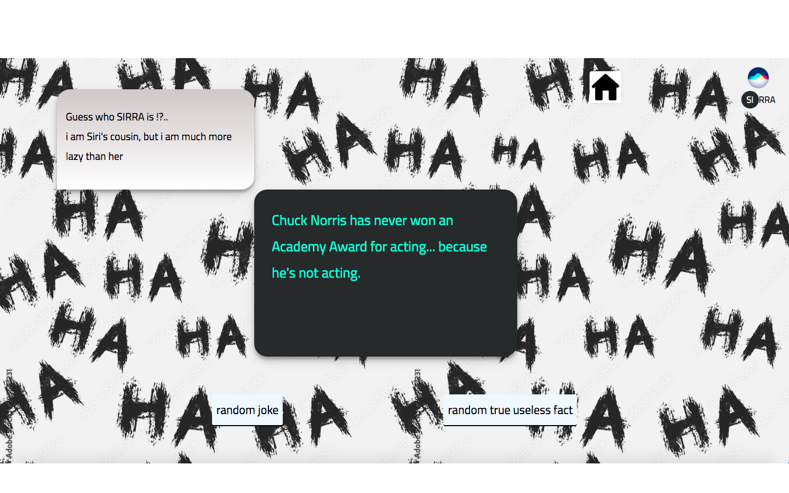
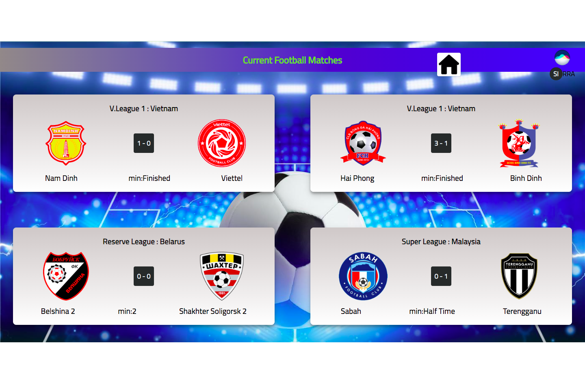
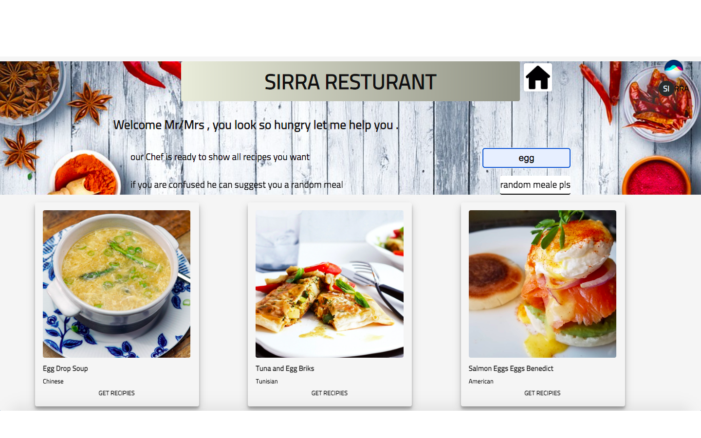

# Sirra-App-API

----

### 1-Description

Sirra app is an app that the user can interact with by choosing the current feeling that he/she feels, and the app shows suggestions that fit with the chosen feeling ,and the suggestions are web pages fetched by the API's of several companies ,websites,or newspeapers .

### 2-Demo

you can try Demo app <a href='https://mones-hamd.github.io/Sirra-App-API/'>her</a>

#### 3-Must Have

<li>  selection element help user to define his feeling
<li>fetch API form weather API
<li> fetch API from New York Times
<li>add search bar for searching about specific article
<li> add back button

#### 4-Nice to have

<li>  create local storage to storage user name .
<li> fetch more API that help user more
<li> add more feelings options .

<li>add feature to filter results in news API .

### 5- app structur

    .
    |                                    #front_end_part
    |--public
    |  |--img
    |  |--style.css
    |  
    |--reademe.md
    |--index.html
    |--src                                #javascript_part
    |  |
    |  |--app.js
    |  |--constant.js
    |  |--views                           #front_end_DOM
    |  |  |--loginView.js
    |  |  |--welcomeView.js 
    |  |  |--newsView
    |  |  |  |--newsView.js
    |  |  |  |--weatherView.js
    |  |  |  
    |  |  |--football&joke
    |  |  |  |--footballView.js
    |  |  |  |--jokesView
    |  |  | 
    |  |  |--foodView
    |  |  |  |--foodView.js
    |  |  |  |--reuseableFoodView.js
    |  |  |
    |  |--pages                      #logic-part
    |  |  |--loginPage.js
    |  |  |--weatherPage.js
    |  |  |--newsPag
    |  |  |  |--newsPage.js
    |  |  |  |--weatherPage.js
    |  |  |
    |  |  |--football&joke
    |  |  |  |--footballPage.js
    |  |  |  |--jokePage.js
    |  |  |
    |  |  |--foodPages
    |  |  |  |--foodPage.js
    |  |  |  |--searchFoodPage.js
    |  |  |  |--foodDetailPages.js
    |  |  |  
    |  |--general
    |  |  |--backButtonView.js
    |  |  |--backButtonPage.js
    |  |  |--logoView.js
    |  |  |--logoPage.js
    |  |  |
    |  |--lib
    |  |--|--localStorage.js
    |  |  |                              #some_reusable_function
    |  |--utility
    |  |  |--fetchAPI.js
    |  |  |--handelError.js
    |  |  |--initNewPage.js
    |  |  |--searchBar.js
    |  |  |
------

## 6- app flow

#### 6-1 Sirra ask user about his/her name

#### 6-2 get the name and store it in local Storage

#### 6-3 initial welcome page with selector feeling

#### 6-3-1 curious! what is the latest news

1-initial new page

  2-initial weather elements and fetch weather data

  3-initial search bar elemnts and prepare to catch value

  4-initial article elements and fetch most pobluar article  

  5- initial search resulte page .

#### 6-3-2 boring ! tell me some jokes

1- initial new page

2- initial page content with tow button

3- random joke button :fetch data from API and show it in monitor

4- random useless true fact button : fetch data from API and show it in monitor

#### 6-3-3 excited ! what are football matches today

1- initial new page

2-initial matches card

3- fetch data from API

4- append data to matches cards

#### 6-3-4 hungry !! tell me some food recipes

1 - initial new page

2- initial header with random button and text field

3- initial food card according to user input

4-get recipe detail button : initial card for food recipe details

---------

### some sirra  photos

#### developed by Mones-Hamd
